# SOULUS

### A Minecraft mod. You must sift through the ashes of the dead to restore life to the world.

[Roadmap](https://trello.com/b/DfeJpjGX/soulus)

Soulus is a mod I created because I was sick of building giant mob-spawning boxes in skyblock modpacks.

It adds in custom spawners, called Summoners, which start out incredibly underpowered but can be upgraded to be extremely fast and efficient. The upgrades are incredibly expensive and will likely take a long time to craft in the early game, but everything can be automated with other mods. The mod is also highly configurable, so you can make everything cheap and easy if you want to.

There are no modpack distribution restrictions for Soulus. You may use it in any modpack, with any launcher. However, there ARE general distribution restrictions. You may not provide downloads of Soulus outside of a modpack. To put it in layman's terms, all downloads of Soulus must either be as part of a modpack, through the [Github](https://github.com/Yuudaari/soulus), or through the [Curseforge](https://minecraft.curseforge.com/projects/soulus).

See below for an in-depth list of features in the mod.

## Table of Contents
- [Download](#download-)
- [Previews](#previews-)
- [No Mob Spawning and No Mob Drops](#no-mob-spawning-and-no-mob-drops-)
- [Sledgehammer](#sledgehammer-)
- [Fossils](#fossils-)
- [Bone Chunks and Essences](#bone-chunks-and-essences-)
- [Soulbook](#soulbook-)
- [Endersteel](#endersteel-)
- [Summoner](#summoner-)
	- [Summoner Upgrades](#summoner-upgrades-)
		- [Oscillating Gear](#oscillating-gear-)
		- [Murky Orb](#murky-orb-)
		- [Blood Crystal](#blood-crystal-)
		- [Niobium Gear](#niobium-gear-)
- [Skewer](#skewer-)
	- [Skewer Upgrades](#skewer-upgrades-)
- [Bone Drops](#bone-drops-)
- [Ash](#ash-)
- [Dark Endersteel](#dark-endersteel-)
- [Endersteel Block](#endersteel-block-)
- [Dark Endersteel Block](#dark-endersteel-block-)
- [Composer](#composer-)
	- [Composer Upgrades](#composer-upgrades-)
- [Unloader](#unloader-)
- [Endersteel Alchemy](#endersteel-alchemy-)
- [Midnight Jewel](#midnight-jewel-)
- [Niobium](#niobium-)
- [Soul Catalyst](#soul-catalyst-)
- [Soul Totem](#soul-totem-)
- [Misc](#misc-)
	- [Glue](#glue-)
	- [Bark](#bark-)
	- [Barket](#barket-)
- [Mod Support](#mod-support-)
- [Language Support](#language-support-)
- [Contributing](#contributing-)

## Download [🡅](#table-of-contents)

[Github](https://github.com/Yuudaari/soulus/releases/latest)

[CurseForge](https://minecraft.curseforge.com/projects/soulus)

## Previews [🡅](#table-of-contents)

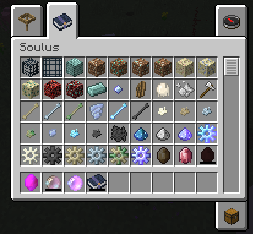

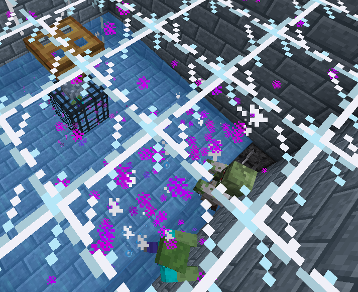

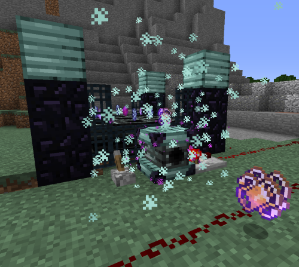

## No Mob Spawning and No Mob Drops [🡅](#table-of-contents)

All mob spawning is disabled by default, but you can configure this functionality per dimension, biome, and creature, and even enable/disable drops for each. See [`creatures/creatures.json`](./docs/CONFIG.md#creaturescreaturesjson-)

## Sledgehammer [🡅](#table-of-contents)

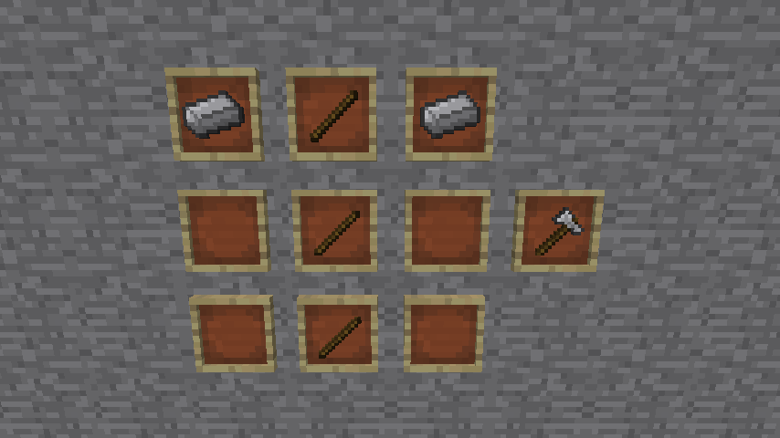

The Sledgehammer is used to smash materials. It is only used as a crafting ingredient, and currently only comes in iron.

## Fossils [🡅](#table-of-contents)

Fossils generate around the world, different types based on the biome and block. Fossils even generate in the nether! These are the kinds of fossils you can expect to see in the world:

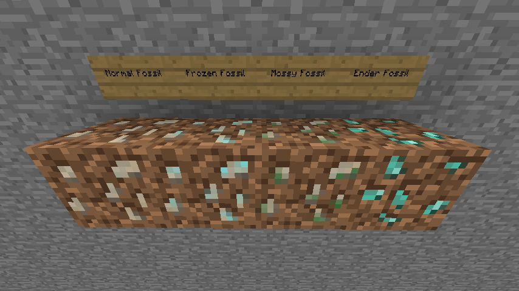
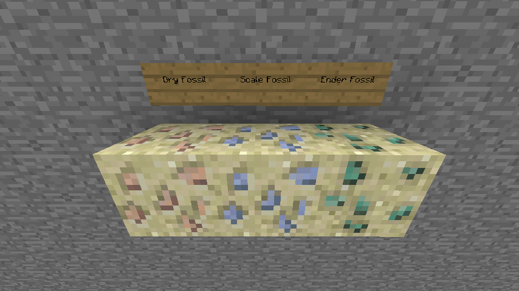
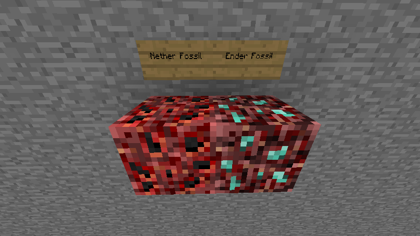

When you destroy a fossil, it will drop between 2 and 6 bone chunks for that kind of fossil.

Fossil veins are configurable (and you can even use the config to generate veins of other kinds of blocks, it's pretty vague). See [`world/veins/veins.json`](./docs/CONFIG.md).

## Bone Chunks and Essences [🡅](#table-of-contents)

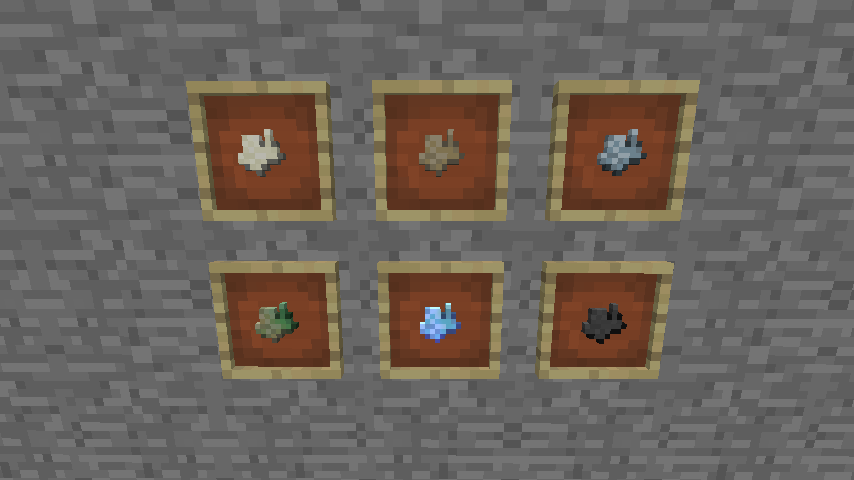

A bone chunk can be crafted with a Sledgehammer to produce bonemeal. Normal bone chunks, dry, frozen, and mossy all produce normal bonemeal, while ender bone chunks produce "ender bonemeal" and blackened bone chunks produce "blackened bonemeal".

The main use of bone chunks, however, is to collect the essence of creatures! By right clicking with a bone chunk, you break it open and collect the essence inside. The possible Essences produced by each bone type is configurable in [`essences/essences.json`](./docs/CONFIG.md#essencesessencesjson-).

## Soulbook [🡅](#table-of-contents)

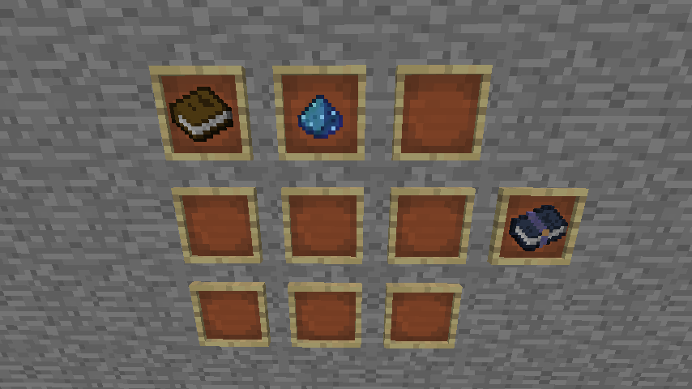

You craft a Soulbook using a book and some ender bonemeal/ender dust. Soulbooks are how you can reconstruct souls from their essence.

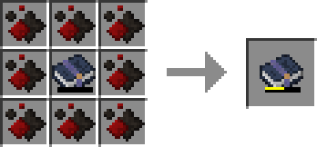
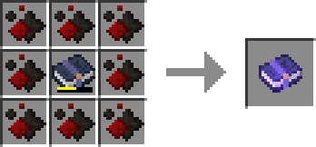

You can fill a soulbook by crafting it with any number of your chosen type of essence. By default all mob types only require 16 essence to reconstruct their soul. That's two crafts if you craft the soulbook with 8 essence each time. 

Late-game, Soulbooks can be filled easier by putting them into a [Composer Cell](#composer-cell-).

## Endersteel [🡅](#table-of-contents)

1. Crush an iron ingot into iron dust.  
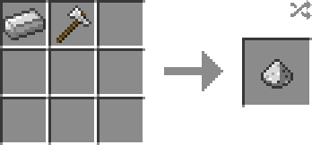

2. Crush an ender bone chunk into ender dust.  
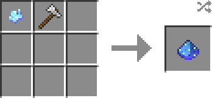

3. Combine iron dust with ender bonemeal, into an ender-iron dust blend.  
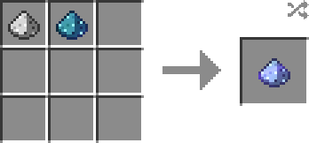

4. Smelt the ender-iron dust blend to get an endersteel ingot!  
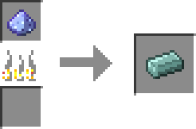

Endersteel can be converted between a block and nuggets. You can craft Endersteel bars from a 3x2 of ingots. The recipe produces 16 bars.

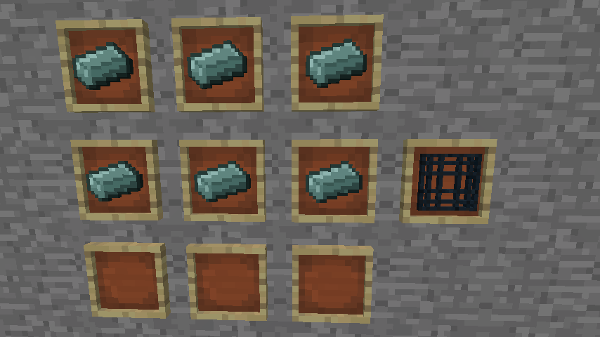

Here's what they look like in the world:

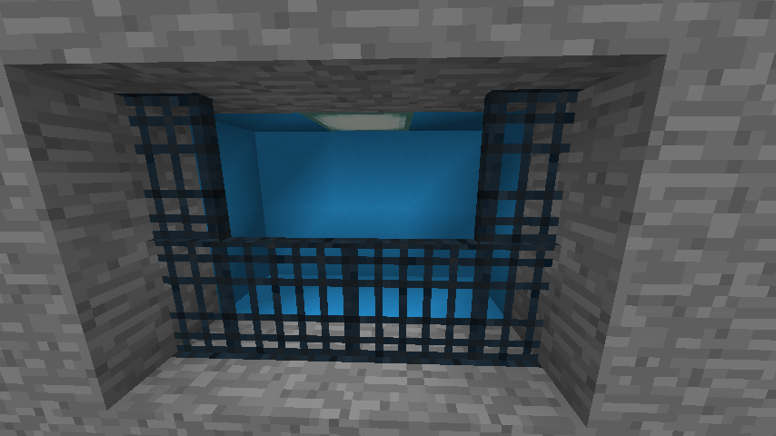

## Summoner [🡅](#table-of-contents)

Using 8 Endersteel bars and an ender bonemeal in the center, you can craft an Empty Summoner.

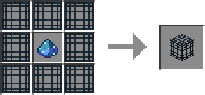

You can also find Summoners in the world, in the places where mob spawners would normally generate. By default, they will have a "Midnight Jewel" inside of them, which allows them to spawn similarly to vanilla spawners. You can change all of this functionality, even per biome, structure, and creature, with [`world/summoner_replacement/replacement.json`](./docs/CONFIG.md#worldsummoner_replacementreplacementjson-).

If you right click on an empty summoner with a filled soulbook, a summoner is created. By default, summoning a mob takes around 10 minutes, only summons one, and you have to be within 3 blocks to increase the summon percentage. (Eg: you can spend 5 minutes at the summoner, then come back later and complete the summon)

Summoning entities does not obey natural spawn rules. You may summon entities anywhere you like, as long as they fit.

If you right click a summoner, all inserted items of the last type inserted are returned. If you sneak + right click a summoner, all items in the summoner are returned.

If a summoner is receiving a redstone signal it will not be active.

Summoners support comparators, they will output a signal strength of 1 if they are at 0% summoned and 15 if they are at 100% summoned. If they're not active, they will output a signal strength of 0.

By default, over time the Summoner will use up the Soulbook inside of it. The amount of essence in its Soulbook translates directly to the uses of the Summoner. Once the Soulbook is empty, the Summoner will stop functioning. Removing the Soulbook after this point, therefore, will return an empty Soulbook, of the current alignment. (Once a Soulbook has an alignment, it cannot be removed)

## Summoner Upgrades [🡅](#table-of-contents)

There are three main upgrades for a summoner. An Oscillating Gear increases the speed, a Blood Crystal increases the quantity, and a Murky Orb increases the activation range.

### Oscillating Gear [🡅](#table-of-contents)

All bone types can be used to create bone gears of varying types.

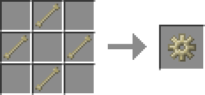

Using most bone types you can make a gear and surround it by endersteel to create an oscillating gear.

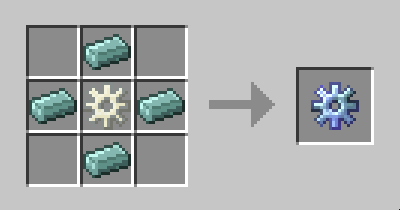

Surrounding an ender bone gear in iron creates 2 oscillating gears. 

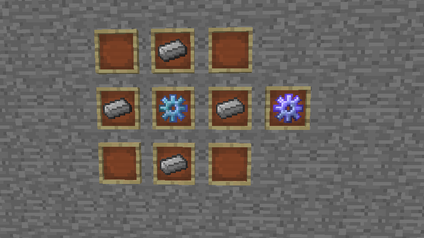

By default, a summoner can hold 16 oscillating gears, ranging from around 10 minutes per summon to around 30 seconds per summon.

### Murky Orb [🡅](#table-of-contents)

Surrounding ender bonemeal with slimeballs (or glue) produces a Strange Sticky Ball. 

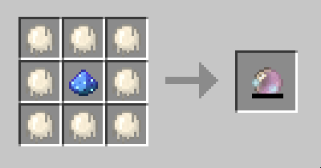

Crafting a Strange Sticky Ball with essence of any type puts the essence into it. At 64 essence it becomes a Murky Orb.

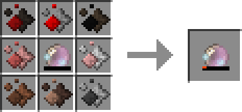
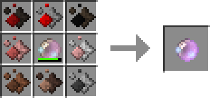

Late-game, Murky Orbs can be filled easier by putting them into a [Composer Cell](#composer-cell-).

When a Murky Orb has been filled, its stack limit is 16.

By default, a summoner can hold 16 murky orbs, ranging from around a range of 5 blocks to be active to around 70 blocks to be active.

### Blood Crystal [🡅](#table-of-contents)

1. Smelting an emerald or soul sand produces a Burnt Emerald.   
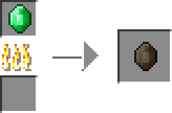
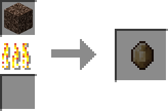

2. Crafting a Burnt Emerald (or a Shattered Blood Crystal) with redstone and a slimeball or glue produces a Bloody Emerald.  
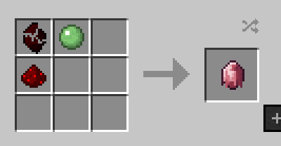

3. Smelting a Bloody Emerald produces a Blood Crystal.  
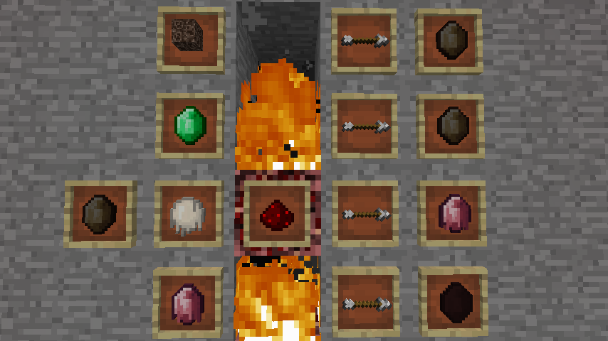

By default, a Blood Crystal requires 1000 blood. You may collect blood in two ways:

- Pricking yourself. Pricking yourself deals 9 damage to you (4.5 hearts) and gives you the effects hunger and nausea. It adds 90 blood to the blood crystal.
- Killing creatures. It deals 1 damage to entities, and collects 3 blood from each prick.

When a Blood Crystal has been filled, its stack limit is 16.

By default, a summoner can hold 16 Blood Crystals, ranging from 1 entity summoned to around 6 entities summoned, max.

### Niobium Gear [🡅](#table-of-contents)

The Niobium Gear is a late-game upgrade for the Summoner which will reduce the Soulbook usage rate of a Summoner. By default, enough Niobium Gears will not prevent all Soulbook usage, only heavily reduce it.

See [Niobium](#niobium-).

## Skewer [🡅](#table-of-contents)

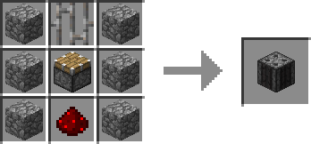

The Skewer is the Soulus way of killing creatures. It has two upgrades, and the upgrades can be inserted and removed in the same way as the [Summoner](#summoner-).

Skewers can be placed in any orientation, and spikes will extend outwards when the block receives a redstone signal. If you are at the same height as the spikes when they're facing upwards, you will collide with them and not be able to walk into them, but if you are any higher than that (eg: on a slab, a trapdoor, snow layers, or even a carpet), you will fall into them and begin to take damage. There is currently no collision protection for other orientations of the skewer.

## Skewer Upgrades [🡅](#table-of-contents)

#### Unfinished Blood Crystal
As the skewer damages entities, it can collect blood into the blood crystal it stores, based on the damage it deals. By default, for each damage it deals to an entity, there is a 50% chance of receiving 1 blood.

#### Nether Quartz (Damage)
By default, the Skewer only deals 1 damage to each entity when they're not resistant to the damage. The Skewer can hold 64 Nether Quartz. At this point it will deal around 6 damage to entities when they're not resistant to the damage.

## Bone Drops [🡅](#table-of-contents)

By default, most mobs drop bones matching the bone type their essence comes from. This is configurable in [`essences/essences.json`](./docs/CONFIG.md#essencesessencesjson-). This config will work with mods, but at the moment Soulus doesn't support any out of the box.

## Ash [🡅](#table-of-contents)

After collecting Blackened Bonemeal, you may use it on plants! This is a horrible, terrible fertilizer which in fact does not grow the plant, but reduces it to a pile of ash. It's also not very nice to do. Plant murderer.

You can use ash as a replacement for essence in a Murky Orb, or to create Dark Endersteel.

## Dark Endersteel [🡅](#table-of-contents)

1. Crush an iron ingot into iron dust.  

2. Crush an ender bone chunk into ender dust.  

3. Combine iron dust with ender dust and ash, into an ash-ender-iron dust blend.  
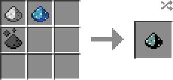

4. Smelt the ash-ender-iron dust blend to get a dark endersteel ingot!  
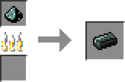

## Endersteel Block [🡅](#table-of-contents)

Crafting 9 endersteel bars into a block produces a Block of Endersteel. When placed into the world, you can use it as a clock, by reading its value via a comparator. The value is 0 when the block is receiving no power. When receiving power, it oscillates in a sin-wave from 0-15, at a speed dependent on the power received.

## Dark Endersteel Block [🡅](#table-of-contents)

Crafting 9 dark endersteel bars into a block produces a Block of Dark Endersteel. When placed into the world, you can use it as a random number generator, by reading its value via a comparator. The value is 0 when the block is receiving no power. Whenever it receives a new power level, it chooses a random output level 1-15.

## Composer Cell [🡅](#table-of-contents)

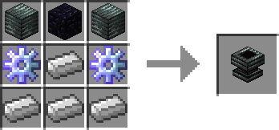 

To put items into a Composer Cell, you may either right click with a stack to put one item into the cell, sneak + right click to put the entire stack into the cell, or simply drop a stack on top of it. The [Unloader](#unloader-) is useful for automating insertion into Composer Cells.

Each Composer Cell can hold up to 64 of the same item. *This ignores normal stack limitations.* 

When a Composer Cell contains exactly one Soulbook, Murky Orb, or Soul Catalyst, you can insert essence into it in order to fill them. This method is much faster and simpler to fill these items than crafting.

## Composer [🡅](#table-of-contents)

The Composer is a block which requires a multiblock structure to be built. It is an autocrafting table, more or less, which is very expensive and slow, but can be upgraded to be very fast. To build a Composer, here's what you will need:

20 [Endersteel Bars](#endersteel-)  
8 Obsidian  
4 [Endersteel Blocks](#endersteel-block-)  
9 [Composer Cells](#composer-cell-)   
1 Composer:  
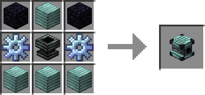

Build the structure like this:  
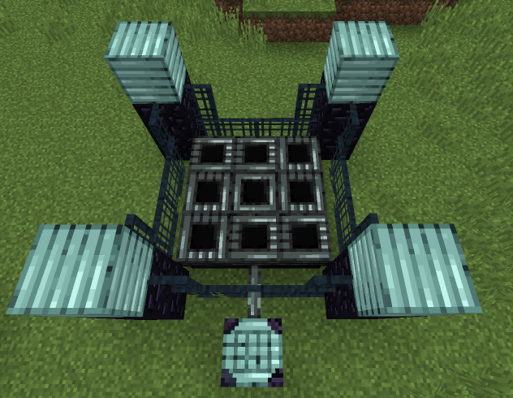

The composer can be on any side, as long as it's in the middle of that side. Multiple composers will not connect to the same structure, however you can use the same bars, obsidian, and endersteel blocks in multiple composers. (potentially building 4 composers for the price of 3! (minus the composer cells and composer, of course))

The orientation of the composer is like a crafting table GUI. When looking at the structure from the composer, the right side is the top row of the crafting grid.

Any container items will be dropped underneath their cells after a composition completes. (You may put another block with an inventory underneath to deposit them into this inventory instead)

The Composer doesn't work quite like the Summoner, in which it would require nearby players to function. Instead, it uses creatures! Each unique creature type nearby makes it go slightly faster. However, each creature type nearby has a `2%` chance of "poofing", or being used up by the Composer, every second. (The creature will vanish entirely in a puff of smoke) EG: To keep a Composer running around the clock, you must feed it creatures with Summoner(s).

Composers support comparators, they will output a signal strength of 1 if they are at 0% composed and 15 if they are at 100% composed. If they're not active, they will output a signal strength of 0.

The Composer can craft any normal crafting recipe. The recipes will take the default amount of time, named `1t`. Recipes exclusive to the Composer can take much longer, such as `512t`, which would mean 512x as long as a normal recipe.

You can [add recipes which will only work in the Composer via CraftTweaker](./docs/CRAFTTWEAKER.md).

## Composer Upgrades [🡅](#table-of-contents)

#### Murky Orb (Range)
The range of the Composer is a 4 block radius from the center Composer Cell. Each Murky Orb extends that radius by 1 block.

#### Oscillating Gear (Speed)
Self explanatory.

#### Niobium Gear (Efficiency)
Decreases the rate at which mobs "poof", from `2%` per second to, when maximally upgraded, `.6%` per second.

## Unloader [🡅](#table-of-contents)

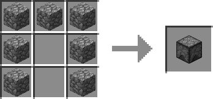

The Unloader is a block that will automatically drop any items put into it. It has no redstone support; to change how fast it drops items, you may feed it with a dropper or dispenser, and power those via redstone.

## Endersteel Alchemy [🡅](#table-of-contents)

Once you have a composer, you may create Endersteel from *any ingot*. The recipe is 8 ingots surrounding a single ender dust, and will return 8 Endersteel ingots. It takes 16x as long as a normal crafting recipe in the Composer. 

After creating Endersteel, you may use it to create any of the other base metals. The metals currently supported are:
- Aluminum
- Copper
- Gold
- Iron
- Lead
- Nickel
- Silver
- Tin
- Zinc

Here's an example:  
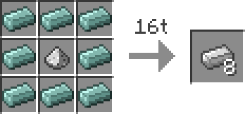

All Endersteel Alchemy recipes are shaped this way, the dust of the metal surrounded by Endersteel Ingots. You will notice this method is not lossless. Consider creating the Endersteel from a renewable resource, such as Bricks, which can be converted into Endersteel the same as all other ingots.

If you believe another metal should be supported, make an issue for it. Note that I will only be adding recipes for metals which are "easy" to collect.

## Midnight Jewel [🡅](#table-of-contents)

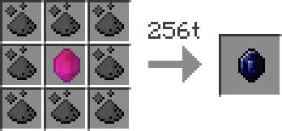

The Midnight Jewel is created from a Blood Crystal surrounded by ash in a Composer. The recipe takes 256x as long as a normal recipe.

Each held Midnight Jewel has a small chance every tick of dealing damage and inflicting negative status effects upon the holder. It will not end well to hold a stack or more of the Jewels.

## Niobium [🡅](#table-of-contents)

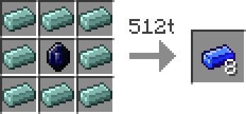

A Midnight Jewel surrounded by Endersteel in the Composer will create 8 Niobium Ingots. Once you have Niobium, you may use its dust to create Niobium easier.

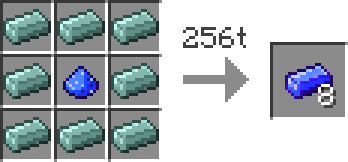

You can craft a Niobium Gear from Niobium, which is usable in the [Summoner](#summoner-), [Composer](#composer-), and [Soul Totem](#soul-totem-) as Efficiency upgrades in each. (Reduces the rate at which they use their respective fuels)

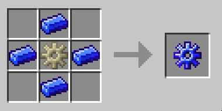

You can also make a block of Niobium with 9 ingots, which has comparator output that is the exact inverse of the input power. EG: Input is 15, output is 0. Input is 4, output is 11. It's like a slightly more powerful redstone torch.

## Soul Catalyst [🡅](#table-of-contents)

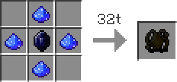

A Midnight Jewel surrounded by 4 niobium dust in a Composer creates a Soul Catalyst. A Soul Catalyst must be filled with essence of any kind. Once it is filled, it can be used as the fuel for a Soul Totem.

Soul Catalysts can be filled via crafting recipes or by putting them into a [Composer Cell](#composer-cell-).

## Soul Totem [🡅](#table-of-contents)

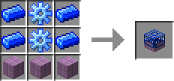

The Soul Totem is the main block of a multiblock structure. It is crafted with Niobium, a Soul Catalyst, and obsidian, and takes Soul Catalysts as fuel. When powered by a Soul Catalyst (inserted like an upgrade), the Soul Totem functions as a player surrogate for the Summoner, and a chunk loader, of the current chunk and the surrounding ring of chunks, for a total of 9 chunks.

Currently, the Soul Totem only has one upgrade, the Niobium Gear, which reduces the rate at which the Soul Catalyst fuel is consumed (to, by default, around a third of the normal rate).

The Soul Totem structure is the Soul Totem on top, with 4 blocks of Dark Endersteel in the corners underneath, and 4 endersteel bars between those. 

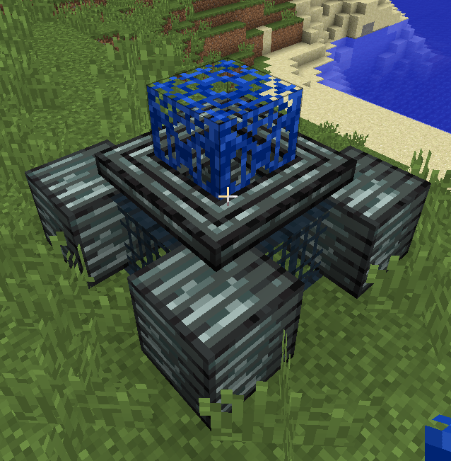

## Misc [🡅](#table-of-contents)

### Glue [🡅](#table-of-contents)

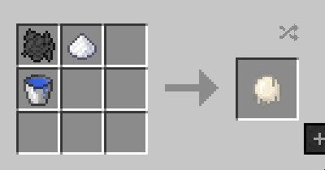

Glue is crafted from sugar, bonemeal, and a bucket of water. It can be used anywhere a slimeball can. You can consume glue.

### Bark [🡅](#table-of-contents)

Every 100 or so logs produces 8 bark instead of a log. You can use 2 bark and 3 paper to make a book.

### Barket [🡅](#table-of-contents)

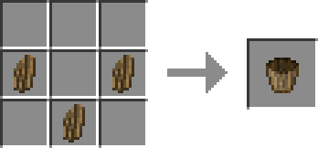

Make a bucket shape with Bark to get a "Barket". It can only pick up water and will likely break in a matter of seconds. If you let it break, you'll spill your water!

## Mod Support [🡅](#table-of-contents)

### Ex Nihilo Creatio

Drops are added automatically to Ex Nihilo Creatio Sieves. The default values are not configurable as they can be configured via Ex Nihilo Creatio configs.

### Other Explicitly Supported Mods

Waila (Hwyla)
JEI
CraftTweaker

## Language Support [🡅](#table-of-contents)
Soulus supports English, by default. The following languages are also supported, but were translated by the community:

- Spanish, by Jairo0108 (last update: 2.2.0)

Thank you for contributing!

## Other Credits [🡅](#table-of-contents)

There are 4 styles for the Summoner, which are craftable and will appear in the world via [summoner replacement](#summoner-) depending on the structure they're in. I made the textures, but they're heavily based on the spawner variants listed in [SimplySarc's "50 Tiny Ways to Improve Minecraft"](https://youtu.be/NSsac8V3BpA). They even appear in the same structures as his recommendations. This feature is meant as a tribute to that great video. I hope to see similar variants in vanilla someday. =)

## Contributing [🡅](#table-of-contents)

If you have an error, bug, or have found an oversight please [leave an issue about it](https://github.com/Yuudaari/soulus/issues). I'll try to get to them as fast as I can. 

If you'd like to translate Soulus to another language, I really appreciate the contribution! See the [English language file](./src/main/resources/assets/soulus/lang/en_us.lang). If you need help, are finished, or just want to ask questions, you can either [make an issue](https://github.com/Yuudaari/soulus/issues) or join my [Discord server](https://discord.gg/fwvBfus).

If you want to help develop Soulus and already know how to mod, great, make an issue and then a PR if you know what you want to do. If you don't know how to mod, I probably won't have the time to help teach you, but you're welcome to join my [Discord server](https://discord.gg/fwvBfus) and chat/ask questions.

If you have a suggestion you can also [leave them as an issue](https://github.com/Yuudaari/soulus/issues). I will close suggestions that I dislike or are out of scope for the mod.

If you want to support me financially, consider supporting me on [Patreon](https://www.patreon.com/yuudaari)!

[The Soulus License Copyright (c) 2018 Mackenzie "Yuudaari" McClane](./LICENSE.md)

---

The following preview images are of a Summoner, with changes to the config file that allow for more upgrades to be inserted and buffed effects for the upgrades:

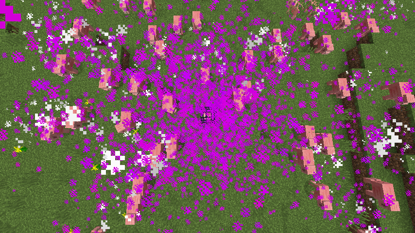

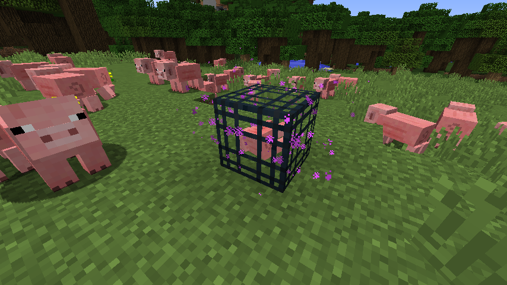

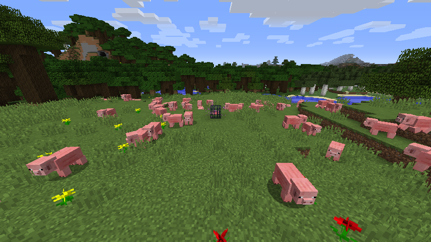

By default, they don't get *quite* this powerful. ;) 
